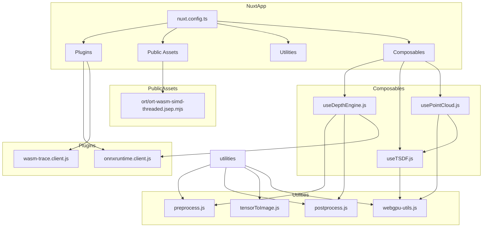

    

    <b>Automatic Architecture Diagrams from Code</b> 
    <a href="https://github.com/swark-io/swark">GitHub</a> • <a href="https://swark.io">Website</a> • <a href="mailto:contact@swark.io">Contact Us</a>

## Usage Instructions

1. **Render the Diagram**: Use the links below to open it in Mermaid Live Editor, or install the [Mermaid Support](https://marketplace.visualstudio.com/items?itemName=bierner.markdown-mermaid) extension.
2. **Recommended Model**: If available for you, use `claude-3.5-sonnet` [language model](vscode://settings/swark.languageModel). It can process more files and generates better diagrams.
3. **Iterate for Best Results**: Language models are non-deterministic. Generate the diagram multiple times and choose the best result.

## Generated Content
**Model**: GPT-4o - [Change Model](vscode://settings/swark.languageModel)  
**Mermaid Live Editor**: [View](https://mermaid.live/view#pako:eNqNVMuK2zAU_RWj9djdZ1GYJi10UwLjoQu5C0W-sVWsB3rQKcP8e2UrtqRYM9SQ6F6dY93XkV8RlT2gA-rEoIkaq_bUico_xl3Cxg_3Yh-VCrvz0zMN1DIpqvZL3BWedpTiygY8mw1d7MaaX5GjJjcwYfA5rAlCJVfSkMsEBh-jnTCcZZPBz_6fWZYhyl0mRvF5WapHY2ALCqLvxF09t-DxfSnES9jEs6mdsIxDQycGwja_01B_iOGtJhRu_Nmv7byxo5dCJ5UlhRk4gbLjV-FPBJy7eXiPtU-nb_i27sCzZMIeJ-l6nHkfZ7X1NGmpBqUlBWNwNPNwvhC7caKdkywII3Urv3MyAM68u8bCZVDueZlxsOtl4B9nHkYeJp7MU9uffi7Yr5_8r16GZBjvaztqID3M_QDV8NLZUcZVXX9eFVvGluhFaMm9iNBUAoFxi7HAUYt77E586-vJiSF2JqB3ObOA3gWjdNYobhVJKH0TRRGNcijBmQxKhEQMW4_C5V5aFMa7JZaVW86uQNmluOeks9hIc9v2Se7u3_9StkGgB8RBc8J6_y1-7ZAdgUOHDlWHergSN9kOvXmSUz2xcGLE3wCODlY7eEDEWfn0V9DV19INIzpcyWTg7R-92Pw3) | [Edit](https://mermaid.live/edit#pako:eNqNVMuK2zAU_RWj9djdZ1GYJi10UwLjoQu5C0W-sVWsB3rQKcP8e2UrtqRYM9SQ6F6dY93XkV8RlT2gA-rEoIkaq_bUico_xl3Cxg_3Yh-VCrvz0zMN1DIpqvZL3BWedpTiygY8mw1d7MaaX5GjJjcwYfA5rAlCJVfSkMsEBh-jnTCcZZPBz_6fWZYhyl0mRvF5WapHY2ALCqLvxF09t-DxfSnES9jEs6mdsIxDQycGwja_01B_iOGtJhRu_Nmv7byxo5dCJ5UlhRk4gbLjV-FPBJy7eXiPtU-nb_i27sCzZMIeJ-l6nHkfZ7X1NGmpBqUlBWNwNPNwvhC7caKdkywII3Urv3MyAM68u8bCZVDueZlxsOtl4B9nHkYeJp7MU9uffi7Yr5_8r16GZBjvaztqID3M_QDV8NLZUcZVXX9eFVvGluhFaMm9iNBUAoFxi7HAUYt77E586-vJiSF2JqB3ObOA3gWjdNYobhVJKH0TRRGNcijBmQxKhEQMW4_C5V5aFMa7JZaVW86uQNmluOeks9hIc9v2Se7u3_9StkGgB8RBc8J6_y1-7ZAdgUOHDlWHergSN9kOvXmSUz2xcGLE3wCODlY7eEDEWfn0V9DV19INIzpcyWTg7R-92Pw3)

